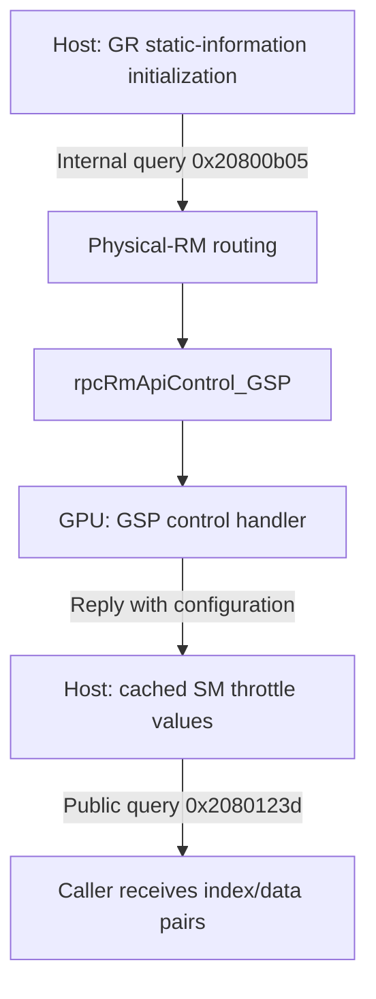

# Where does the restriction take effect?

Source baseline: NVIDIA open GPU kernel modules **615.71.09**, commit `61dcc93722ecb418bb5f2e00923f05b4b8051dd1`. This analysis uses source inspection and public NVIDIA documentation, without GPU testing, driver installation, or firmware modification.

## Assessment and limits

The SM instruction-throttle interface points toward GPU-side configuration exposed through GPU-resident firmware. The open CPU-side driver contains a reporting path, not an identified implementation of the D v2 AI restriction.

**Confirmed:** the internal query executes through GSP firmware, and the public header describes its returned data as fuse values.

**Not confirmed:** that this mechanism causes the D v2 AI cap; which instruction types it restricts on that card; whether enforcement is permanently fused, programmed by firmware, or dependent on additional proprietary software.

Firmware is software running on the GPU. Possibilities include a fixed hardware limit that firmware reports and a hardware execution limit that firmware configures. The published code cannot distinguish them. The word "fuse" alone does not establish that a returned value is an immutable, directly read physical fuse rather than a derived or shadowed configuration value.

| Question | Finding | Boundary |
| --- | --- | --- |
| Does the host handle the public query? | Yes, it returns cached configuration. | Confirmed in source. |
| Where is the internal query handled? | GSP firmware on physical GSP-client GPUs. | Confirmed by routing, API binding, and transport. |
| Does the host query path throttle instructions? | No instruction pacing or throttle-register writes were identified in this path. | This is not a claim about all proprietary components. |
| Is the configuration hardware-related? | The interface describes fuse values and instruction-throttle fields. | Strong lead, not a verified D v2 mechanism. |
| Is the D v2 AI cap permanently fused? | Unknown. | Firmware handler and relevant register definitions are absent. |
| Does patch 2 remove this SM restriction? | It does not alter this path. | No performance effect established. |

## The exact query path

This diagram describes information retrieval only. It does not assert an enforcement path between GSP and the SMs.



### 1. The host requests static information

[kernel_graphics.c:1445](https://github.com/NVIDIA/open-gpu-kernel-modules/blob/61dcc93722ecb418bb5f2e00923f05b4b8051dd1/src/nvidia/src/kernel/gpu/gr/kernel_graphics.c#L1445) invokes `NV2080_CTRL_CMD_INTERNAL_STATIC_KGR_GET_SM_ISSUE_THROTTLE_CTRL` and caches the returned per-GR-engine information in `pSmIssueThrottleCtrl`.

The speed-selector query is immediately before it. Both are static configuration snapshots, not time-series measurements of active throttling.

### 2. The internal host handler is compiled out

[g_subdevice_nvoc.c:8882](https://github.com/NVIDIA/open-gpu-kernel-modules/blob/61dcc93722ecb418bb5f2e00923f05b4b8051dd1/src/nvidia/generated/g_subdevice_nvoc.c#L8882) assigns method `0x20800b05` flags `0x1c0c0`.

[control.h:156](https://github.com/NVIDIA/open-gpu-kernel-modules/blob/61dcc93722ecb418bb5f2e00923f05b4b8051dd1/src/nvidia/inc/kernel/rmapi/control.h#L156) disables a local method when it has `ROUTE_TO_PHYSICAL` and lacks `PHYSICAL_IMPLEMENTED_ON_VGPU_GUEST`:

```text
0x1c0c0 & 0x00040 = 0x40   (route to physical implementation)
0x1c0c0 & 0x40000 = 0      (no guest implementation exception)
```

The generated local function pointer is therefore `NULL`. Its generated wrapper is also excluded by the same preprocessor condition. Removing that condition would not supply the missing implementation.

### 3. The host forwards the control to GSP

[resource.c:264](https://github.com/NVIDIA/open-gpu-kernel-modules/blob/61dcc93722ecb418bb5f2e00923f05b4b8051dd1/src/nvidia/src/kernel/rmapi/resource.c#L264) routes firmware-client controls marked `ROUTE_TO_PHYSICAL` through `NV_RM_RPC_CONTROL`.

[rpc.h:219](https://github.com/NVIDIA/open-gpu-kernel-modules/blob/61dcc93722ecb418bb5f2e00923f05b4b8051dd1/src/nvidia/inc/kernel/vgpu/rpc.h#L219) delegates firmware-client requests to the physical RM API. [rpc_common.c:74](https://github.com/NVIDIA/open-gpu-kernel-modules/blob/61dcc93722ecb418bb5f2e00923f05b4b8051dd1/src/nvidia/src/kernel/rmapi/rpc_common.c#L74) explicitly binds that API's `Control` function to `rpcRmApiControl_GSP` for GSP clients.

[rpc.c:10785](https://github.com/NVIDIA/open-gpu-kernel-modules/blob/61dcc93722ecb418bb5f2e00923f05b4b8051dd1/src/nvidia/src/kernel/vgpu/rpc.c#L10785) constructs a `GSP_RM_CONTROL` message containing the command and parameters. At [rpc.c:10849](https://github.com/NVIDIA/open-gpu-kernel-modules/blob/61dcc93722ecb418bb5f2e00923f05b4b8051dd1/src/nvidia/src/kernel/vgpu/rpc.c#L10849), it sends the message and waits. Response processing separates transport status from the status returned by the actual handler on GSP.

This establishes where the query executes. It does not expose the handler's register accesses or the hardware enforcement logic.

### 4. The public getter returns cached values

[kernel_graphics.c:3470](https://github.com/NVIDIA/open-gpu-kernel-modules/blob/61dcc93722ecb418bb5f2e00923f05b4b8051dd1/src/nvidia/src/kernel/gpu/gr/kernel_graphics.c#L3470) validates requested indexes and returns cached index/data pairs. It does not program the SM instruction scheduler.

Changing these values changes reported information. The visible code provides no basis for claiming this would change the underlying execution limit. Behavior of proprietary consumers of the values remains outside this inspection.

## Register and firmware findings

[ctrl2080gr.h:1694](https://github.com/NVIDIA/open-gpu-kernel-modules/blob/61dcc93722ecb418bb5f2e00923f05b4b8051dd1/src/common/sdk/nvidia/inc/ctrl/ctrl2080/ctrl2080gr.h#L1694) defines `MASK` and `CREDIT` indexes and describes the results as fuse values. It does not document mask-bit meanings, credit units, instruction-family mapping, or a throughput formula.

No matching SM issue-throttle setter or hardware-register definition was identified in the published control interfaces, Blackwell register headers, or relevant host graphics code. The public GB202 [dev_fuse_zb.h](https://github.com/NVIDIA/open-gpu-kernel-modules/blob/61dcc93722ecb418bb5f2e00923f05b4b8051dd1/src/common/inc/swref/published/blackwell/gb202/dev_fuse_zb.h) exposes GSP/SEC2 firmware-version fields, not the SM issue-throttle layout. Those version fuses are not evidence of an AI throughput fuse.

NVIDIA's [GSP documentation](https://download.nvidia.com/XFree86/Linux-x86_64/580.65.06/README/gsp.html) explains that GPU initialization and management can execute on GSP. The repository's [firmware extraction documentation](https://github.com/NVIDIA/open-gpu-kernel-modules/blob/61dcc93722ecb418bb5f2e00923f05b4b8051dd1/nouveau/extract-firmware-nouveau.txt) distinguishes separately distributed GSP-RM binaries from auxiliary firmware in the source tree. The handler body needed for the next step is not provided here as source.

## Release timing does not establish enforcement

| Date | Observation | Meaning |
| --- | --- | --- |
| 2022-05-09 | Generic host CUDA-limit code is already present in 515.43.04. | This path predates Blackwell. |
| January 2025 | NVIDIA advertises 2,375 AI TOPS for the original 5090 D and a January 30 launch. | The reduced advertised AI rating predates the August query. |
| 2025-08-04 | 580.65.06 introduces the SM-throttle query in the available source history. | This dates an exposed interface, not the start of enforcement. |
| 2025-08-12 | RTX 5090 D v2 launches. | Eight days after the query addition; timing alone is not causation. |
| 2026-03-05 | 595.45.04 adds the `CREDIT` index. | Another interface change, not proof hardware throttling changed then. |

Primary product sources: [NVIDIA's January announcement](https://blogs.nvidia.cn/blog/nvidia-blackwell-geforce-rtx-50-series-opens-new-world-of-ai-computer-graphics/) and [ZOTAC's August 12 D v2 announcement](https://www.zotaccn.com/nd.jsp?id=184). Driver dates come from the inspected repository's Git history.

The August patch adds requesting, caching, returning, and freeing throttle information. It does not expose a new enforcement loop. Launch-date proximity is a historical lead, not evidence that the AI cap is implemented by this host code.

## Consequences for the experimental patches

- **Patch 1 remains useful for diagnostics:** it records firmware-returned configuration and whether the separate host CUDA clock-limit handler is invoked. It cannot identify undocumented bit meanings by itself.
- **Patch 2 remains a separate, unverified experiment:** it suppresses the generic host-requested CUDA clock-limit path on `0x2B8C`. It does not change the SM query, its cached values, the GSP handler, or instruction-throttle fuses/registers.
- A suppressed CUDA-limit request is not evidence of an AI unlock. With tracing confirmed active, absence of an enable request during a workload makes this particular host-path hypothesis inapplicable to that workload.
- No evidence currently supports editing the device-name table, fabricating unrestricted query results, or removing physical-routing flags as a working solution.

The next source-level evidence needed is the firmware-side handler or an authoritative SM throttle register map, followed by an explanation of how its values are selected and enforced on this SKU. Neither is available in this source checkout. A performance claim would additionally require hardware validation, which has not been performed.

The existing patches and offline validation results are unchanged by this analysis.
